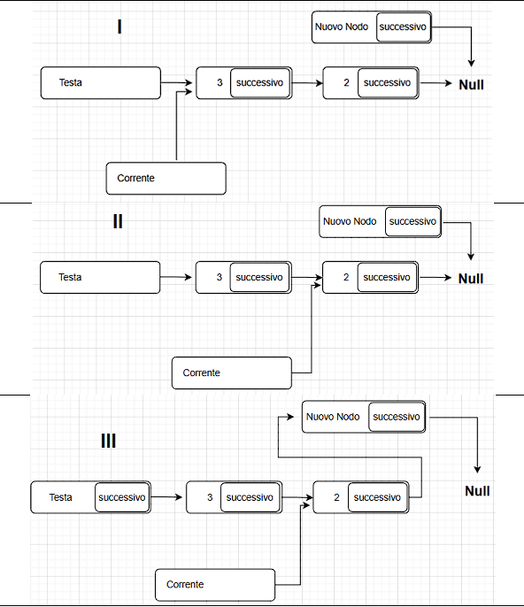
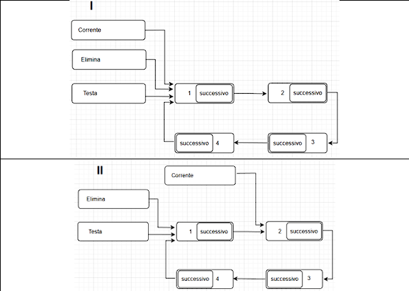
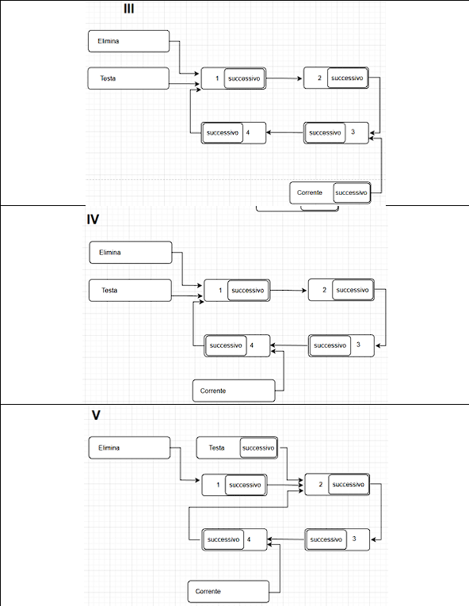
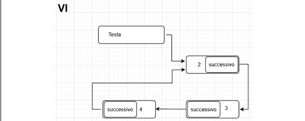
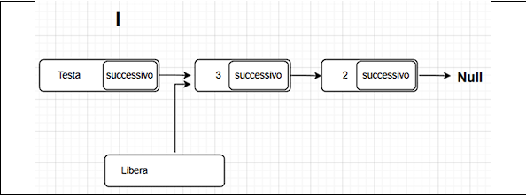
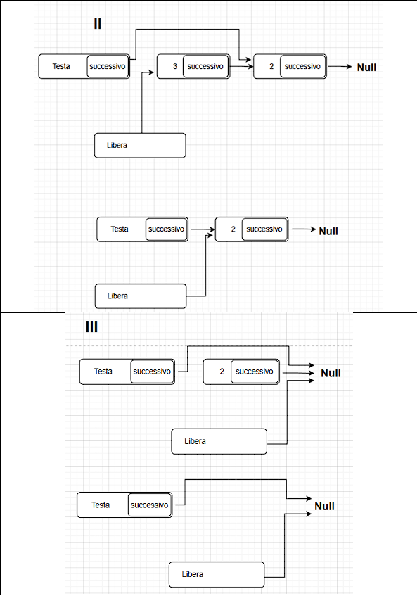

# 1. Che cosa è una Struct?  
È un tipo di dato definito dall’utente.  
È un “contenitore” che permette di raggruppare tipi di dati diversi sotto un unico nome 
identificativo. 
Una volta definita la struttura, è possibile dichiarare variabili di quel tipo che conterranno tutte le 
informazioni previste.
## Esempi di dichiarazione `struct` in C

### 1. Struttura generica

```c
struct Nome {
    TipoDato1 nome1;
    TipoDato2 nome2;
    ...
};
```
```c
struct Anagrafe {
    char nome[50];
    int età;
};
```
```c
struct Anagrafe {
    char nome[50];
    int età;
} Persona;
```

# Perché si usano le Struct? 
Facilità d’uso e organizzazione: 
evitano di avere tante variabili “sciolte” e slegate tra loro; 
per aggiungere nuovi dati basta inserire nuovi campi nella dichiarazione della Struct senza 
stravolgere il resto del codice; 
permettono di spostare interi blocchi di informazioni correlate contemporaneamente, ad esempio 
durante il passaggio di parametri alle funzioni.

## Confronto tra variabili singole e `struct` in C

|                        | Variabili                                                                  | Struct                                                                                   |
|------------------------|----------------------------------------------------------------------------|------------------------------------------------------------------------------------------|
| **Dichiarazione**      | `char nome[50];`<br>`int età;`<br>`float stipendio;`                        | `struct Anagrafe {`<br>`char nome[50];`<br>`int età;`<br>`float stipendio;`<br>`} Persona;` |
| **Passaggio a funzione** | `void stampa(char nome[], int età, ...)`                                 | `void stampa(struct Anagrafe Persona)`                                                  |
| **Accesso ai dati**    | `età = 36;`                                                                | `Persona.età = 36;`                                                                      |

# 3. Quali sono le alternative alle Struct?
L'alternativa principale consiste nel dichiarare e gestire ogni dato in modo separato. ogni singola 
informazione (come nome, età o stipendio) è gestita come una variabile indipendente e slegata 
dalle altre (“sciolte”).

# 4. Scrivere un struct che definisce un biglietto di un concerto?
```c
Struct Biglietto 
{   
    char artista[50];  
    float prezzo;   
    int posto;  
};
```
# 5. Che opzioni abbiamo per memorizzare delle struct?
### ARRAY
 Una collezione di elementi dello stesso tipo in posizioni di memoria contigue. L'accesso è 
diretto tramite indice (es.: concerto[i].prezzo), ma la dimensione è fissa e difficile da modificare 
(non impossibile). 
### LISTE
Strutture che contengono i dati e un puntatore verso l'elemento successivo in memoria. Non 
hanno una dimensione fissa e possono crescere o decrescere in base alle esigenze. Per trovare un 
dato, però, è necessario scorrere la lista partendo dal primo elemento
# 6. Perché conviene una lista?
A differenza dell'array che ha una dimensione fissa stabilita alla dichiarazione, la lista è dinamica. 
L'array può causare sprechi di memoria se vengono utilizzate poche celle rispetto a quelle 
dichiarate. La lista occupa memoria solo per gli elementi effettivamente presenti. 
In un array, eliminare un dato può richiedere lo spostamento di tutti gli elementi successivi per 
coprire il buco. In una lista, l'aggiunta o l'eliminazione di un elemento è più semplice poiché basta 
aggiornare i puntatori dei nodi coinvolti senza spostare i dati fisicamente in memoria.
# 7. Perché ci poniamo il problema di una struct?
In alcuni contesti, come gli archivi, è utile usare strutture che contengono informazioni raggruppate 
e che semplificano il lavoro di gestione (inserimento, eliminazione, ricerca, ecc.).
# 8. Definire una struttura di una lista.
La struttura base di una lista è il nodo. Per funzionare correttamente, deve contenere due parti 
fondamentali: 
le informazioni che vogliamo memorizzare (dati). 
un puntatore che punta al nodo seguente della lista (collegamento).
```c
struct Nodo 
{ 
    int dato; 
    struct Nodo  *successivo; 
};
```
# 9. Spiegare come funziona l’inserimento in coda.
L'inserimento in coda significa aggiungere un elemento alla fine della lista.  
Il procedimento segue questi passaggi: 
Si alloca memoria per il nuovo nodo (usando malloc) e si riempiono i suoi dati. 
Il puntatore successivo del nuovo nodo deve essere impostato a NULL (perché diventerà l'ultimo 
della lista). 
Si parte dalla testa e si scorre tutta la lista finché non si trova il nodo che ha successivo==NULL. 
Si aggiorna il puntatore successivo dell'ex-ultimo nodo facendolo puntare al nuovo nodo. 
```c
Nodo *nuovo_nodo = (Nodo*)malloc(sizeof(Nodo)); 
nuovo_nodo→valore = dato; 
nuovo_nodo→successivo = NULL; 
if (testa→successivo == NULL) 
{ 
    testa→successivo = nuovo_nodo;
} 
else 
{ 
    Nodo *corrente = testa; 
    while (corrente→successivo!= NULL)
    { 
        corrente = corrente→successivo; 
    } 
    corrente→successivo = nuovo_nodo;
}
```


# 10. eliminazione in testa di una lista circolare 
In una lista circolare, l'ultimo nodo punta di nuovo al primo invece che a Null. 
La coda deve puntare al secondo elemento della lista, e poi si libera la memoria della vecchia testa 
(free). 
Dobbiamo scorrere la lista fino alla fine per poter aggiornare questo collegamento.

```c
Nodo *corrente = testa;  
Nodo *cancella = testa;  
 
if (testa != NULL) 
{   
    if (testa->successivo == testa) 
    {  
        free(testa);  
        testa = NULL;  
    } 
    else 
    { 
        while (corrente->successivo!= testa) 
        {  
            corrente = corrente->successivo;  
        }  
 
        testa = testa->successivo; 
        corrente->successivo = testa;  
        free(cancella);  
    } 
}
```




# 11. Scrivere un codice per liberare tutta la memoria occupata da una lista. 
Crei un puntatore libera che punta al primo nodo della lista (testa→successivo). 
La testa della lista “salta” il primo nodo e si collega al successivo. in questo modo, il nodo è isolato 
dalla lista.  
Usi free (libera ) per cancellare definitivamente il nodo isolato. 
Sposti il nodo libera sul successivo e ricominci, finché dopo la testa non rimane più nulla (NULL.) 

```c
Nodo *libera = testa→successivo; 
 
while (libera != NULL) 
{ 
    testa→successivo = libera→successivo; 
    free(libera); 
    libera = testa→successivo; 
}
```




# 12. Eliminazione di una struct  
Struct statica: se dichiari una struct normalmente, non serve un comando specifico. La memoria 
viene liberata automaticamente dal sistema quando la funzione finisce o il programma termina. 
Struct dinamica: se crei la struct con la funzione malloc, essa rimane occupata "per sempre" nella 
memoria. Per eliminarla, devi usare manualmente il comando free(puntatore).

# 13. Definire una struct che rappresenti un contatto di una rubrica. 
Per rappresentare un contatto, dobbiamo raggruppare variabili di tipo diverso (stringhe per i testi e 
numeri per il telefono).

```c
struct Contatto {  
    char nome[50];  
    char cognome[50];  
    char telefono[20]; 
    char professione[30];  
    char email[50];  
};
```

# 14. Come dichiarare un array di struct? 
Ci sono due strade per dichiarare l'array: 
Statica: La dimensione è fissa e decisa alla compilazione, 
Dinamica: La dimensione può cambiare durante l'esecuzione usando malloc. Questo permette di 
risparmiare memoria se non sai in anticipo quanti contatti avrai.

## Allocazione statica vs dinamica in C

###  Allocazione Statica

```c
typedef struct {
    char nome[50];
    char telefono[20];
    ...
} Contatto;

Contatto rubrica[100];

printf("Inserisci nome: ");
scanf("%s", rubrica[0].nome);
```
###  Allocazione Dinamica

```c
typedef struct {
    char nome[50];
    char telefono[20];
    ...
} Contatto;

Contatto *rubrica = NULL;

printf("Quanti contatti vuoi inserire? ");
scanf("%d", &n);

// OPZIONE A: Allocazione iniziale per n contatti
rubrica = (Contatto *) malloc(n * sizeof(Contatto));

// OPZIONE B: Allocazione di un singolo contatto alla volta
rubrica = (Contatto *) realloc(rubrica, 1 * sizeof(Contatto));

printf("Inserisci nome: ");
scanf("%s", rubrica[0].nome);
```

# 15. Visualizza tutti i nodi della lista
Per visualizzare i dati, bisogna "scorrere” tutta la lista dalla testa alla fine. 
Si usa un puntatore d'appoggio (visualizza) per scorrere i nodi uno alla volta fino a quando non si 
incontra NULL.

```c
printf(“Visualizza...\n”); 
Nodo *visualizza = testa→successivo; 
 
printf(“Testa→ “); 
                
while (visualizza != NULL) 
{ 
    printf(“[%d]→ “, visualizza→valore); 
    visualizza = visualizza→successivo; 
} 
printf(“NULL”); 
printf(“\n”);
```

# 16. Ricerca di un nodo in una lista
Simile alla visualizzazione, ma ci si ferma quando si trova il dato cercato. 
Si confronta il campo di ogni nodo con il dato da cercare (nel l’esempio è un int) usando le funzioni 
appropriate.

```c
printf("Ricerca...\n");          
Nodo *ricerca = testa->successivo; 
int posizione = 1, trovato = 0; 
 
printf("Valore da trovare: "); 
scanf("%d", &dato);

while (ricerca != NULL) 
{ 
    if (ricerca->valore == dato)
    { 
        printf("Valore %d trovato in posizione %d\n", dato, posizione); 
        trovato++; 
    } 
    ricerca = ricerca->successivo; 
    posizione++; 
}
printf("Nella lista di %d elementi il valore %d è presente %d volte\n", posizione-1, dato, trovato); 
```

# 17. Liste circolari: cosa cambia? 
In una lista "normale", l'ultimo nodo punta a NULL. In una lista circolare, l'ultimo nodo punta di 
nuovo al primo nodo (testa). 
Non c'è mai un vero "punto di interruzione". Bisogna controllare se siamo tornati alla testa per 
evitare loop infiniti. 

# 18. Come si crea una lista
```c
typedef struct {  
    char nome[50];  
    char telefono[20];  
} Contatto;  
 
typedef struct Nodo {  
    Contatto info;  
    struct Nodo* next; 
} Elemento; 
 
… 
Elemento* testa = NULL;  
… 
 
Elemento* nuovoNodo = (Elemento*) malloc(sizeof(Elemento)); 
printf("Inserisci nome: ");  
scanf("%s", nuovoNodo->info.nome);  
printf("Inserisci telefono: ");  
scanf("%s", nuovoNodo->info.telefono); 
nuovoNodo->next = testa; 
testa = nuovoNodo;
```